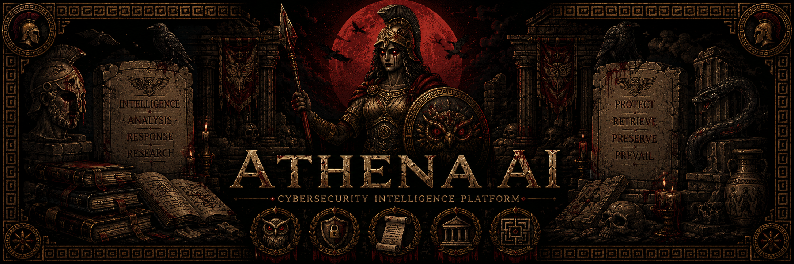

<div align="center">

# 🛡️ Athena AI



         


**Enterprise-grade cybersecurity AI assistant powered by Qwen3.6-27B, Cyber LoRA, Retrieval-Augmented Generation (RAG), and a large-scale cybersecurity knowledge base.**

</div>
---

# 📖 Overview

Athena AI is an advanced cybersecurity-focused Large Language Model (LLM) platform designed to assist security researchers, penetration testers, SOC analysts, students, and cybersecurity professionals.

The project combines:

- Qwen3.6-27B
- Cybersecurity-specific LoRA Fine-Tuning
- Qdrant Vector Database
- Retrieval-Augmented Generation (RAG)
- Large-scale Cybersecurity Knowledge Base

Athena AI is designed to provide intelligent cybersecurity assistance through contextual reasoning, semantic search, threat intelligence retrieval, vulnerability analysis, and security research support.

---

# ✨ Features

## AI Capabilities

- Intelligent Cybersecurity Assistant
- Context-Aware Conversations
- Long-Term Memory System
- Threat Intelligence Analysis
- Vulnerability Research Assistance
- Security Report Generation
- Log Analysis
- Malware Research Support
- Incident Response Guidance

## Retrieval Capabilities

- Semantic Search
- Vector Similarity Search
- Context Retrieval
- Large-Scale Knowledge Base Querying
- Real-Time Information Injection

---

# 🏗 System Architecture

```text
                        ┌─────────────────┐
                        │      User       │
                        └────────┬────────┘
                                 │
                                 ▼
                   ┌────────────────────────┐
                   │   Athena AI Interface │
                   └────────────┬───────────┘
                                │
                                ▼
                   ┌────────────────────────┐
                   │ Memory & Context Layer │
                   └────────────┬───────────┘
                                │
          ┌─────────────────────┼─────────────────────┐
          │                     │                     │
          ▼                     ▼                     ▼

   ┌─────────────┐      ┌─────────────┐      ┌─────────────┐
   │   Qdrant    │      │ Cyber LoRA  │      │ Tool Layer  │
   │ Vector DB   │      │             │      │             │
   └──────┬──────┘      └──────┬──────┘      └──────┬──────┘
          │                    │                    │
          ▼                    ▼                    ▼

   ┌────────────────────────────────────────────────────┐
   │               Qwen3.6-27B Base Model              │
   └────────────────────────────────────────────────────┘
                                │
                                ▼
                        Final Response
```

---

# 🛠 Technology Stack

## Artificial Intelligence

| Component | Technology |
|------------|------------|
| Base Model | Qwen3.6-27B |
| Fine-Tuning | QLoRA |
| Framework | Unsloth |
| Quantization | 4-Bit |
| Precision | BF16 |
| Embeddings | BGE-Large |

## Backend

| Component | Technology |
|------------|------------|
| Language | Python |
| API | Flask |
| Database | SQLite |
| Vector Database | Qdrant |

---

# 🚀 Training Infrastructure

Training is performed using cloud GPU infrastructure.

| Component | Specification |
|------------|------------|
| Provider | RunPod |
| GPU | NVIDIA H100 SXM |
| VRAM | 80GB |
| CUDA | 12.x |
| OS | Ubuntu 22.04 |
| Framework | PyTorch |
| Fine-Tuning Library | Unsloth |
| Optimization | Flash Attention |

---

# 🧠 Fine-Tuning Pipeline

```text
Cybersecurity Dataset
          │
          ▼
Data Cleaning
          │
          ▼
Instruction Formatting
          │
          ▼
Tokenization
          │
          ▼
Qwen3.6-27B Base
          │
          ▼
QLoRA Fine-Tuning
          │
          ▼
Cybersecurity LoRA
          │
          ▼
Evaluation
          │
          ▼
Deployment
```

## Fine-Tuning Configuration

```yaml
Model: Qwen3.6-27B
Method: QLoRA
Quantization: 4-Bit
Precision: BF16
Optimizer: AdamW
Framework: Unsloth
```

---

# 🔍 Retrieval-Augmented Generation (RAG)

Athena AI uses Retrieval-Augmented Generation (RAG) to provide factual and up-to-date cybersecurity knowledge.

## RAG Flow

```text
User Query
     │
     ▼
Query Embedding
     │
     ▼
Qdrant Search
     │
     ▼
Top Relevant Chunks
     │
     ▼
Context Assembly
     │
     ▼
Qwen3.6-27B + Cyber LoRA
     │
     ▼
Generated Response
```

---

# 📚 Knowledge Base

Current target knowledge base:

95+ GB Cybersecurity Data

Sources:

- CVE Databases
- MITRE ATT&CK
- Security Advisories
- Threat Intelligence Reports
- Malware Analysis Reports
- Security Blogs
- Security Documentation
- Research Papers
- Incident Response Playbooks

---

# 🔗 Embedding Configuration

Embedding Model:

BAAI/bge-large-en-v1.5

Alternative:

nomic-embed-text

Configuration:

```yaml
Chunk Size: 1000
Chunk Overlap: 150
Top K: 10
Distance Metric: Cosine
```

---

# 📂 Project Structure

```text
Athena-AI/
│
├── app.py
├── requirements.txt
├── README.md
│
├── ai/
│   ├── llm.py
│   ├── memory.py
│   └── prompts/
│
├── rag/
│   ├── embeddings.py
│   ├── qdrant_client.py
│   └── retrieval.py
│
├── datasets/
│
├── tools/
│   ├── report_generator.py
│   ├── log_analyzer.py
│   └── file_manager.py
│
├── templates/
│
└── workspace/
```

---

# ⚙ Installation

```bash
git clone https://github.com/vrunalp199/Athena-AI

cd Athena-AI

python -m venv venv
```

Activate environment:

Linux:

```bash
source venv/bin/activate
```

Windows:

```bash
venv\Scripts\activate
```

Install dependencies:

```bash
pip install -r requirements.txt
```

---

# 🗄 Qdrant Setup

Using Docker:

```bash
docker run -p 6333:6333 \
-v $(pwd)/qdrant_storage:/qdrant/storage \
qdrant/qdrant
```

Verify:

```text
http://localhost:6333/dashboard
```

---

# 📈 Embedding Generation

Install dependencies:

```bash
pip install sentence-transformers
pip install qdrant-client
```

Example:

```python
from sentence_transformers import SentenceTransformer

model = SentenceTransformer(
    "BAAI/bge-large-en-v1.5"
)

embedding = model.encode(
    "Explain SQL Injection"
)
```

---

# 🌐 Deployment Architecture

```text
Internet
    │
    ▼
Flask API
    │
    ▼
Athena AI Core
    │
    ├── Memory System
    │
    ├── Qdrant Vector DB
    │
    └── Qwen3.6-27B
            │
            ▼
      Cyber LoRA
            │
            ▼
        Response
```

---

# 📊 Performance Targets

|       Metric      |      Target     |
|-------------------|-----------------|
|       Model       |   Qwen3.6-27B   |
|      Dataset      |      95+ GB     |
|     Embeddings    |     GE-Large    |
|     Vector DB     |      Qdrant     |
| Retrieval Latency |     < 2 sec     |
|     Deployment    |      Docker     |
|        GPU        |     H100/A100   |

---

# 🛣 Roadmap

## Phase 1

- Core AI Assistant
- Memory System
- Prompt Engineering

## Phase 2

- Cybersecurity LoRA
- Advanced RAG
- Vector Search Optimization

## Phase 3

- Multi-Agent Architecture
- Threat Intelligence Agent
- Malware Analysis Agent

## Phase 4

- SIEM Integration
- Security Automation
- Enterprise Deployment

---

# ⚠ Disclaimer

Athena AI is intended for educational purposes, cybersecurity research, defensive security operations, and authorized security testing only.

Users are responsible for complying with all applicable laws and regulations.

---

# 📜 License

MIT License

---

## 👨‍💻 Author

<p align="center">
  
</p>

<p align="center">
  <b>Vrunal Patil</b><br>
  Computer Science Student<br>
  Cybersecurity Researcher
  AI Developer
</p>

⭐ If you find this project useful, consider starring the repository.
